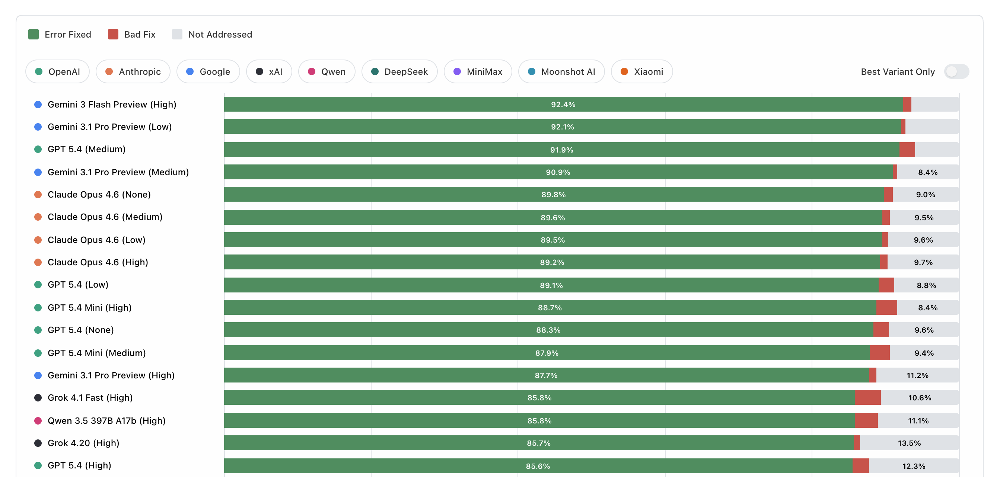
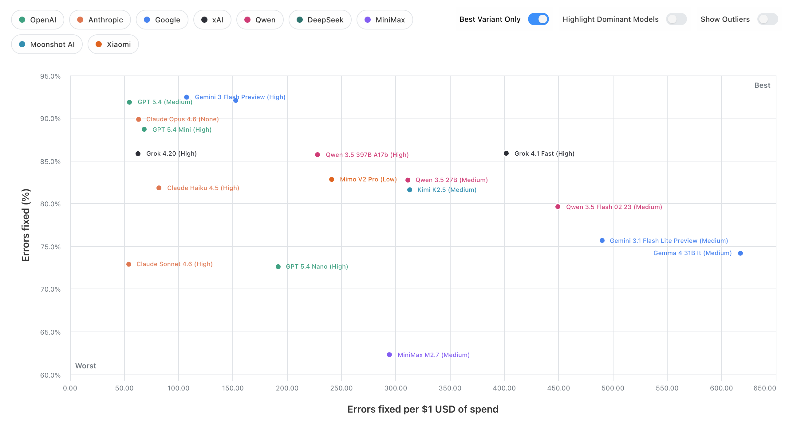

# ErrataBench

ErrataBench measures how well LLMs can proofread text.

The benchmark uses a simple agent loop that lets models find errors in various text samples, and fix them using tools. Each sample includes issues drawn from categories such as spelling, grammar, word choice, and typos. Error density is steady at about 5 issues per 1,000 words.

A public viewer for the latest run is hosted at [https://revise.io/errata-bench](https://revise.io/errata-bench).

The official result set included in this repo covers 51 model variants across 1600+ run samples. Instructions can be found below for running the benchmark yourself with an OpenRouter API key, or OpenAI-compatible API.

[](https://revise.io/errata-bench)
[](https://revise.io/errata-bench)

## Running the benchmark

The easiest way to run the benchmark is with an [OpenRouter](https://openrouter.ai/) key. Configure your key in a .env file.

Then, you can run the benchmark with default settings:

```
npm install
npm run bench
```

Running the full benchmark with 3 samples per model per text costs about $550. You can perform a smaller or larger run using the command line flags:

### Flags

The runner has several parameters you can provide, which all have defaults:

`--group-id`: default `official-v1`. String ID for the result group to which your results will be added. Use your own result group ID to start from scratch.

`--samples`: default `3`. Number of times we run the benchmark for each model on each text.

`--models`: comma-separated list of models. By default we use the list in `models/starter-models.json`.

`--chunk-size`: default `2000`. Word limit used when splitting up text from the dataset into chunks. Models work on text one chunk at a time. Reducing chunk size can yield better results, but at higher cost.

`--max-turns-per-chunk`: default `3`. Number of passes the model gets on a chunk before we move to the next chunk. Models can advance early by calling the `proofreading_complete` tool. Like chunk size, increasing this can yield better results at a higher cost.

`--concurrency`: default 30. How many agent loops to run at a time.

With the default parameters, a model is proofreading ~2000 words at a time, containing ~10 errors.


## Providing your own model endpoint
ErrataBench can run against any endpoint that exposes an OpenAI-compatible `POST /chat/completions` API with tool calling.

This is useful if you want to benchmark:

- an unreleased internal model
- a self-hosted model behind an OpenAI-compatible gateway
- a provider other than OpenRouter

Configure the benchmark transport in `.env`:

```
cp .env.example .env
```

Set these values:

- `ERRATA_BENCH_API_PROVIDER=openai-compatible`
- `ERRATA_BENCH_API_BASE_URL=https://your-endpoint.example/v1`
- `ERRATA_BENCH_API_KEY=...`

Optional but recommended:

- `ERRATA_BENCH_API_ENDPOINT_LABEL=my-lab`
  This label is stored in run and results artifacts so results from different backends do not get mixed together.
- `ERRATA_BENCH_API_REASONING_MODE=omit`
  Use this if your endpoint rejects the OpenRouter-style `reasoning` object. Leave it as `passthrough` if your endpoint accepts reasoning parameters.
- `ERRATA_BENCH_DEFAULT_JUDGE_MODEL=my-org/my-judge-model:none`
  Set this if you want alternative-fix judging on your custom endpoint. Otherwise pass `--no-judge`.
- `ERRATA_BENCH_PRICING_FILE=/abs/path/to/pricing.json`
  For non-OpenRouter endpoints, cost metrics are `n/a` unless you provide a pricing file.

Minimal example:

```
ERRATA_BENCH_API_PROVIDER=openai-compatible
ERRATA_BENCH_API_BASE_URL=https://your-endpoint.example/v1
ERRATA_BENCH_API_KEY=your-api-key
ERRATA_BENCH_API_ENDPOINT_LABEL=my-lab
ERRATA_BENCH_API_REASONING_MODE=omit
ERRATA_BENCH_DEFAULT_JUDGE_MODEL=my-org/my-judge-model:none
```

Then run the benchmark normally, but point `--models` and `--judge-model` at the model ids your endpoint expects:

```
npm run bench -- \
  --group-id my-endpoint-run \
  --dataset datasets/v1/generated \
  --runs 3 \
  --models my-org/my-model:none \
  --judge-model my-org/my-judge-model:none
```

Notes:

- The harness appends `/chat/completions` automatically if your base URL does not already end with it.
- Your endpoint must support tool calling. ErrataBench relies on `find_and_replace`, `replace_paragraph`, and `proofreading_complete`.
- If you compare OpenRouter runs with custom-endpoint runs, keep `ERRATA_BENCH_API_ENDPOINT_LABEL` distinct so the artifacts stay separable.
- OpenRouter pricing lookup only works when `ERRATA_BENCH_API_PROVIDER=openrouter`. For every other backend, use `ERRATA_BENCH_PRICING_FILE` if you want cost charts.
- If your endpoint has a stricter completion-token cap than ErrataBench's default, override it with `--max-completion-tokens-per-turn`.
- The built-in default judge model is OpenRouter-specific. On a custom endpoint, either set `ERRATA_BENCH_DEFAULT_JUDGE_MODEL`, pass `--judge-model`, or use `--no-judge`.

## Viewing results

Results from the latest official run are hosted at [https://revise.io/errata-bench](https://revise.io/errata-bench).

The repo also contains a CLI for viewing results which you can use for the official result set, or your own.

```
npm run view:rankings my-result-group
npm run view:scatterplot my-result-group
```

## Implementation

Each source text is split into word-limited chunks. The model edits one chunk at a time using three tools:

- `find_and_replace(paragraphId, find, replace)` for small local fixes
- `replace_paragraph(paragraphId, newParagraphHtml)` for broader paragraph rewrites
- `proofreading_complete(note)` to end the current chunk early when it looks done

The model sees HTML paragraphs like:

```
<p id="A1b2C3">...</p>
<p id="D4e5F6">...</p>
```

Each dataset case contains a known list of benchmark issues with an expected bad span and canonical fix. Scoring happens issue by issue:

- if the final text contains the expected fix and no longer contains the bad text, the issue is counted as fixed
- if the bad text is gone but the model used a different replacement, the fallback judge decides whether that alternative repair is still valid
- if the model changed the bad text but the repair is still not valid, it counts as a `bad fix`
- if the bad text remains, it counts as `not addressed`

The headline quality score is the share of benchmark issues that end up fixed after that process. Results views then aggregate those per-run scores across datasets, along with cost, speed, tool-use efficiency, and run-to-run range.

## Source Credits

The v1 dataset for this benchmark is composed of excerpts from the following sources:

- `the-call-of-the-wild-chapter-3.txt`
  - Original: "The Call of the Wild" - Jack London
  - Source: https://www.gutenberg.org/files/215/215-h/215-h.htm
- `aerodynamics-of-flight.txt`
  - Original: "Pilot's Handbook of Aeronautical Knowledge" - FAA
  - Source: https://www.faa.gov/regulations_policies/handbooks_manuals/aviation/phak
- `owid-what-is-economic-growth.txt`
  - Original: "What is economic growth? And why is it so important?" - Max Roser
  - Source: https://ourworldindata.org/what-is-economic-growth
- `owid-better-learning.txt`
  - Original: "Millions of children learn only very little. How can the world provide a better education to the next generation?" - Max Roser
  - Source: https://ourworldindata.org/better-learning
- `owid-global-decline-fertility-rate.txt`
  - Original: "The global decline of the fertility rate" - Max Roser
  - Source: https://ourworldindata.org/global-decline-fertility-rate
- `uk-hospital-surgery.txt`
  - Original: "Facilities for surgical procedures: Volume 1" - NHS Estates
  - Source: https://www.england.nhs.uk/wp-content/uploads/2021/05/HBN_26.pdf
- `law-of-nations.txt`
  - Original: "Law of Nations" - James Mill
  - Source: https://oll.libertyfund.org/titles/mill-law-of-nations
- `extent-of-knowledge.txt`
  - Original: "An Essay Concerning Humane Understanding" - John Locke
  - Source: https://en.wikisource.org/wiki/An_Essay_Concerning_Human_Understanding_(Troutman_%26_Hayes_1853)/Book_4/Chapter_III
- `reznor-heater.txt`
  - Original: "INSTRUCTIONS EGHB Model" - Reznor LLC
  - Source: https://assets.reznorhvac.com/download/B61EF32C-8533-482F-83C8-F140B18CCB10
- `sherlock-red-headed-league.txt`
  - Original: "The Adventures of Sherlock Holmes" - Arthur Conan Doyle
  - Source: https://gutenberg.org/ebooks/1661
- `jury-instructions.txt`
  - Original: "Manual of Model Civil Jury Instructions" - Ninth Circuit Jury Instructions Committee
  - Source: https://www.ce9.uscourts.gov/jury-instructions/sites/default/files/WPD/Civil_Instructions_9_2025.pdf

## Adding datasets

To generate a new benchmark case from a clean source text:

```
npm run generate:corrupted -- \
  --source datasets/v1/sources/my-source.txt \
  --issues-per-1000-words 5 \
  --max-words-per-chunk 500 \
  --model google/gemini-3.1-pro-preview:medium \
  --review-model anthropic/claude-opus-4.6:low
```

This writes a corrupted text file and a matching dataset JSON into `datasets/v1/generated/`. If you want the corruptor to favor underrepresented issue categories, add `--dataset-to-balance datasets/v1/generated`.
